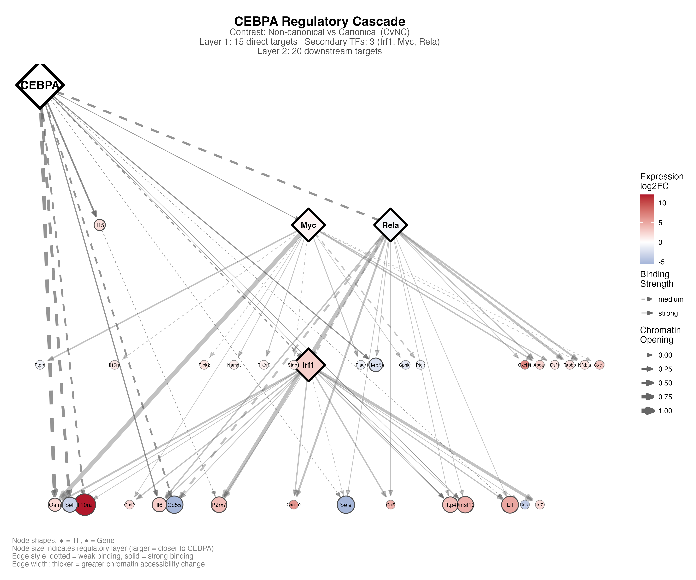
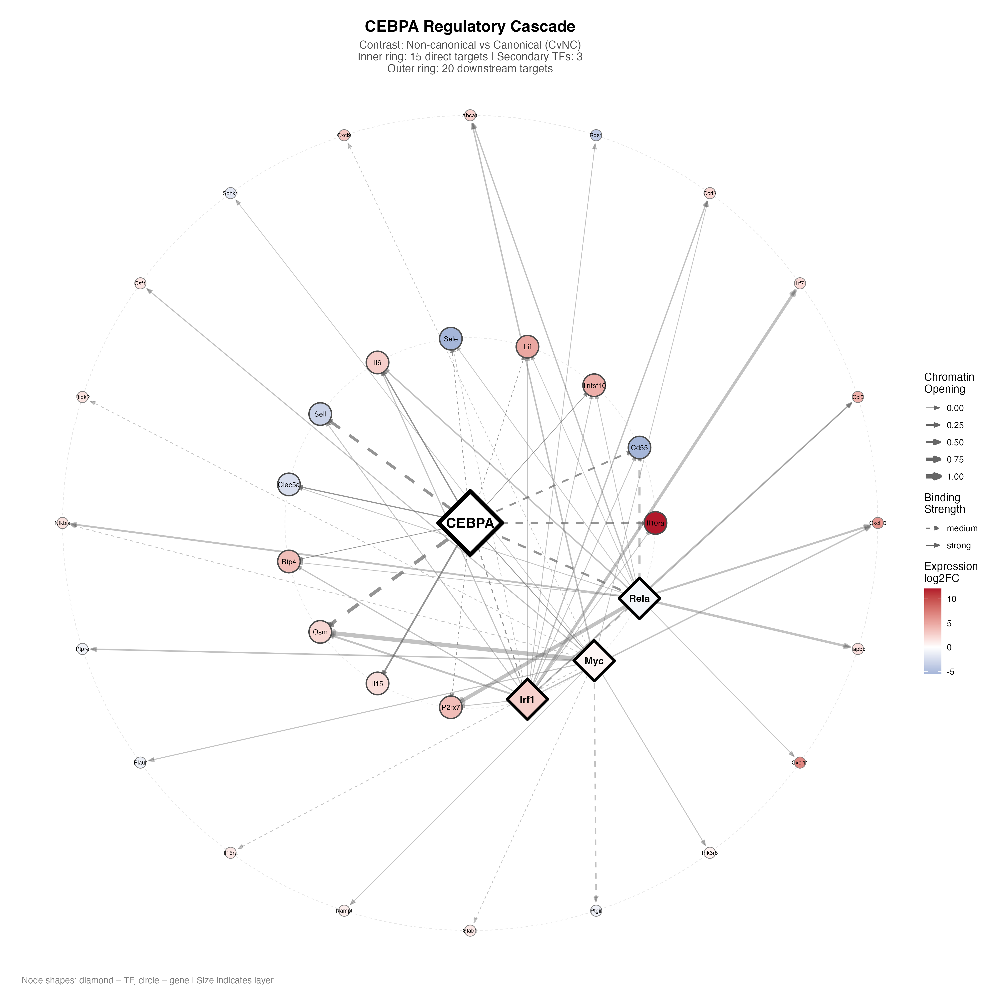
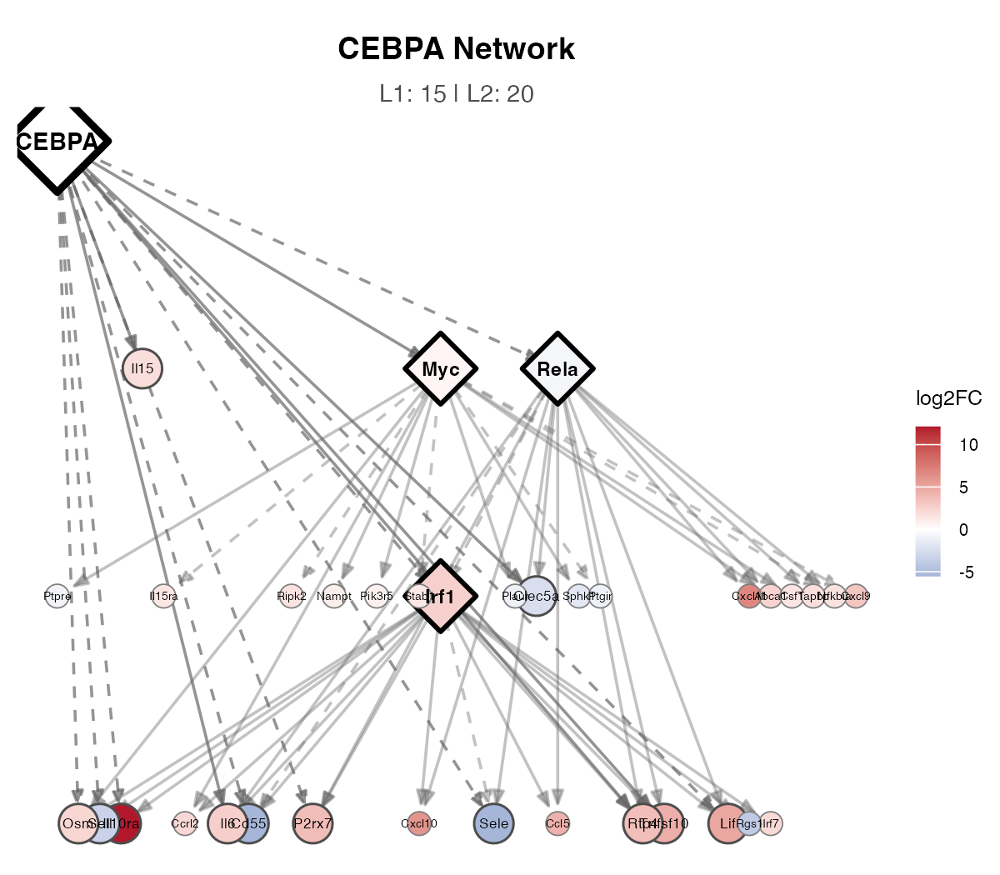

# RNA-ATAC-TF-Network

[](https://www.python.org/downloads/)
[](https://www.r-project.org/)
[](https://opensource.org/licenses/MIT)

A multi-omics integration tool that combines **TOBIAS TF footprinting**, **ATAC-seq accessibility**, and **RNA-seq expression** to build pathway-centric transcription factor regulatory networks.


*Example: CEBPA regulatory cascade showing primary TF, secondary TFs, and downstream target genes colored by expression changes.*

## Overview

RNA-ATAC-TF-Network integrates three data modalities to construct TF→gene regulatory networks:

1. **TF Binding (TOBIAS)**: Identifies TF binding sites from ATAC-seq footprinting
2. **Chromatin Accessibility (ATAC-seq)**: Measures differential accessibility at regulatory regions
3. **Gene Expression (RNA-seq)**: Links accessibility changes to expression changes

The pipeline outputs:
- TF-gene regulatory edge tables with integrated scores
- Pathway-centric network visualizations
- TF-focused cascade networks showing regulatory hierarchies
- Cytoscape-compatible files for interactive exploration

## Key Features

- **Multi-omics integration**: Combines TF footprinting, chromatin accessibility, and gene expression
- **Pathway-centric analysis**: Focuses on biologically relevant MSigDB pathways (Hallmark, KEGG, REACTOME)
- **TF cascade networks**: Visualizes regulatory hierarchies from primary TF → secondary TFs → target genes
- **Publication-ready plots**: High-quality PNG and PDF network visualizations
- **Cytoscape export**: Generate files for interactive network exploration
- **Flexible configuration**: YAML-based configuration for easy customization

## Quick Start

### 1. Clone the repository

```bash
git clone https://github.com/your-username/RNA-ATAC-TF-Network.git
cd RNA-ATAC-TF-Network
```

### 2. Install dependencies

```bash
./install/setup.sh
```

Or install manually:
```bash
pip install -r install/requirements.txt
Rscript install/install_r_packages.R
```

### 3. Configure your analysis

```bash
cp config/config_template.yaml config/config.yaml
# Edit config/config.yaml with your data paths
```

### 4. Run the pipeline

```bash
# Run for a specific contrast
./run_pipeline.sh NvT

# Run with TF-focused analysis
./run_pipeline.sh NvT --tf_focus

# Run all contrasts
./run_pipeline.sh all
```

### 5. View outputs

```
output/
├── NvT/
│   ├── tables/        # Edge/node tables, TF activity, DE results
│   ├── plots/         # Network visualizations
│   └── cytoscape/     # Cytoscape-compatible files
└── tf_focus/
    ├── tables/        # TF cascade edge/node tables
    └── plots/         # TF cascade visualizations
```

## Input Data Requirements

| File | Source | Description |
|------|--------|-------------|
| `TF_MAT.csv` | TOBIAS | TF binding score matrix (TFs × samples) |
| `bindetect_results.txt` | TOBIAS BINDetect | Differential TF binding results |
| `BINDetect/` folder | TOBIAS BINDetect | Per-TF BED files with binding sites |
| `peaks_annotated.txt` | ChIPseeker/HOMER | Peak annotations with gene assignments |
| `rna_counts.csv` | featureCounts/Salmon | RNA expression count matrix |
| `metadata.csv` | User-created | Sample conditions and groups |

See [docs/INPUT_DATA_FORMAT.md](docs/INPUT_DATA_FORMAT.md) for detailed specifications.

## How It Works

### Edge Scoring

Each TF→Gene regulatory edge is scored by integrating:

```
EdgeScore = TF_binding × Accessibility_change × Expression_change × Distance_weight
```

- **TF_binding**: Differential TF binding score from TOBIAS BINDetect
- **Accessibility_change**: log2FC of chromatin accessibility at the binding site
- **Expression_change**: log2FC of target gene expression
- **Distance_weight**: Exponential decay based on distance to TSS (promoters weighted highest)

### TF Cascade Networks

The TF-focused analysis builds hierarchical networks:

- **Layer 0**: Primary TF of interest (e.g., CEBPA)
- **Layer 1**: Direct targets (genes with TF binding sites in accessible regions)
- **Layer 2**: Targets of secondary TFs (regulatory cascade expansion)


*Circular layout showing regulatory layers radiating outward from the primary TF.*

## Output Files

### Tables

| File | Description |
|------|-------------|
| `tf_gene_edges_*.tsv` | TF→gene edges with scores |
| `tf_gene_nodes_*.tsv` | Node attributes (TF activity, expression) |
| `tf_activity_*.tsv` | TF-level activity scores |
| `rna_de_*.tsv` | RNA differential expression results |
| `peak2gene_*.tsv` | Peak-to-gene mapping with weights |

### Plots

| File | Description |
|------|-------------|
| `network_*_PATHWAY.png/pdf` | Pathway-specific network plots |
| `emap_*.png/pdf` | Enrichment map (pathway similarity network) |
| `tf_focus_TF.png/pdf` | TF cascade network (hierarchical layout) |
| `tf_focus_TF_circular.png/pdf` | TF cascade network (radial layout) |
| `tf_focus_TF_compact.png/pdf` | Compact version for figure panels |

See [docs/OUTPUT_FILES.md](docs/OUTPUT_FILES.md) for detailed descriptions.

## Example Gallery

<table>
<tr>
<td><br/><em>Cascade (hierarchical)</em></td>
<td><br/><em>Cascade (circular)</em></td>
<td><br/><em>Compact panel</em></td>
</tr>
</table>

## Documentation

- [INPUT_DATA_FORMAT.md](docs/INPUT_DATA_FORMAT.md) - Detailed input file specifications
- [WORKFLOW.md](docs/WORKFLOW.md) - Step-by-step usage guide
- [OUTPUT_FILES.md](docs/OUTPUT_FILES.md) - Output file descriptions

## Citation

If you use this tool in your research, please cite:

```
[Your citation here]
```

Also consider citing the underlying tools:
- **TOBIAS**: Bentsen M, et al. (2020) TOBIAS: Detecting transcription factor footprints. Nature Communications.
- **MSigDB**: Liberzon A, et al. (2015) The Molecular Signatures Database. Cell Systems.

## License

This project is licensed under the MIT License - see the [LICENSE](LICENSE) file for details.

## Contributing

Contributions are welcome! Please feel free to submit a Pull Request.

## Support

For questions or issues, please open an issue on GitHub.
